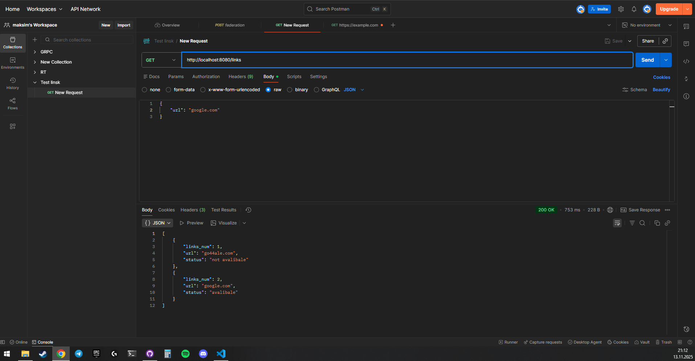

# 10.11.2025
начал писать проект
+сделал архетектру приложения
+написал репозитории
+написл модель

# 12.11.2025
\\доделал сервис( бизнесс логигу)
\\сделал логику для проверки валидности сайта

# 13.11.2025
написал Openapi.yaml
настроил Makefile

# написал хэндлеры, и все закончил кроме сохранение ПДФ # 13.11.2025

все работает оченб просто, я сделал 2 GET запроса, для получение данных с ID и без него, так же буду делать и POST запрос для создание и получение PDF файла с сохранеными(который указал пользователь) ссылки

cаму логику для получние валидности сылки есть в сервисе  ( isAliveLinsk ) под капотом работает очень, обычный запрос на сайт, и получние от него какого либо ответа, так же поставил таймер на 5 секунд